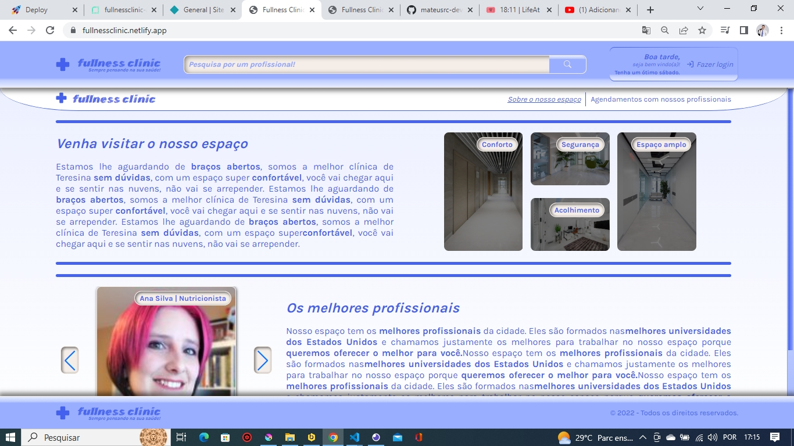
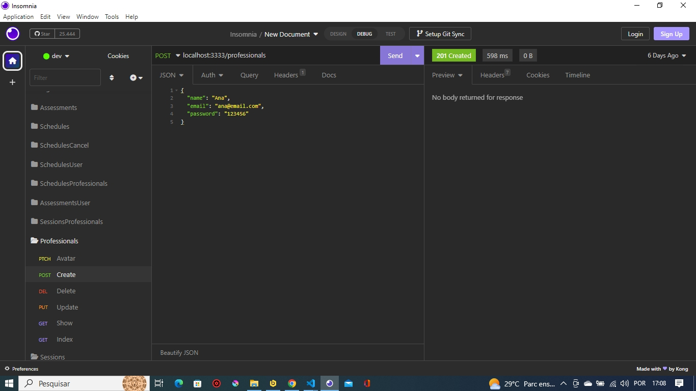

# Parte front-end da aplicação clínica de saúde clinicfulness... Faz parte de uma atividade do curso Explorer da Rocketseat (um projeto pessoal) - Parte visual do aplicativo fullness clinic (FRONT-END)

  

➡️ Esse aplicativo é bem denso e tentei aplicar vários aprendizados do curso Explorer da Rocketseat, é um projeto pessoal no qual usei minha criatividade para criar as funcionalidades da aplicação, as interfaces, etc. Essa aplicação é uma clínica de saúde, tem a página Home que apresenta informações de uma clínica fictícia, o usuário pode visualizar os profissionais e filtrar eles por área de formação (ex. psicologia, nutrição, etc.) ou por tags (ex. depressão, ansiedade, etc.). Ao clicar em um profissional, é aberto a página de detalhes sobre esse profissional, o usuário pode ler a descrição, depoimentos dos clientes desse profissional, e também visualizar os horários disponíveis para agendar uma consulta. Ao clicar em um horário disponível, é aberto a tela de confirmação, e caso o usuário não estiver logado, aparece um link para ele ser redirecionado para a tela de login.

➡️ Na tela de login é possível entrar como usário ou como profissional de saúde. 

### O usuário comum ao logar pode:

- Colocar informações no perfil, como foto, queixa, nome, idade
- Agendar consultas
- Deixar depoimentos de profissionais
- Desmarcar consultas
- Deixar o feedback de que a consulta foi realizada
- Favoritar seus profissionais favoritos
- Visualizar todos os depoimentos criados
- Visualizar todas as consultas agendadas, realizadas, desmarcadas
- Visualizar todos os profissionais favoritados

### O profissional de saúde ao logar pode:

- Colocar informações no perfil, como foto, descrição, nome, área de atuação, tags
- Criar novos horários
- Cancelar horários
- Cancelar consultas agendadas pelo cliente e deixar uma justificativa
- Pode visualizar as consultas agendadas pelos clientes e visualizar informações sobre o cliente (como nome, idade, queixa)
- Visualizar todas as consultas realizadas, por realizar, desmarcadas

Nesse aplicativo usamos as seguintes técnicas:

- Componentes
- Migrations na parte de back-end
- Criação de interfaces com react-js
- Uso de estados (useState)
- Uso de hooks (useEffect, useRef)
- Uso de ícones (react-icons)
- Uso de bibliotecas como moment, express, etc.

### Para utilizar o projeto como desenvolvedor siga os seguintes passos:

1. Você precisa ativar o servidor tanto no arquivo front-end como no back-end com o comando "npm run dev"

2. Na parte de back-end, você pode apagar o database e depois que ativar novamente o servidor com o comando "npm run dev" o database será criado novamente e a tabela 'users', mas também será necessário posteriormente usar o comando "npm run migrate" para criar as migrations (pois outras tabelas criadas com esse método) que utilizam o knex.

3. Após os servidores estarem ativados, podemos usar as rotas. Para utilizar o usuário de profissional da aplicação é importante usar o insomnia para criar um usuário para o profissional, pois não existe uma rota na aplicação pra criar esse usuário de profissional, existe apenas as rotas para criar contas para o cliente na aplicação - a rota para ser utilizada no insomnia para criar a conta do profissional é "localhost:3333/professionals" e os dados precisam ser inseridos em formato JSON (segue exemplo abaixo): 

  

{
	"name": "Marcos",
	"email": "marcos@email.com",
	"password": "123456"
}

## A aplicação foi colocada no ar e você pode experimentar ela clicando no link abaixo:

- https://fullnessclinic.netlify.app/
